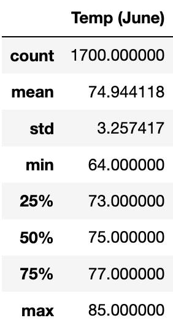
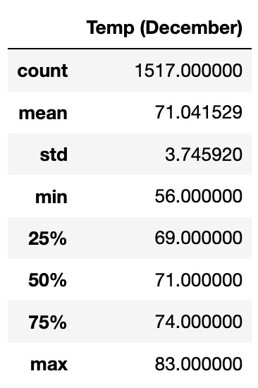
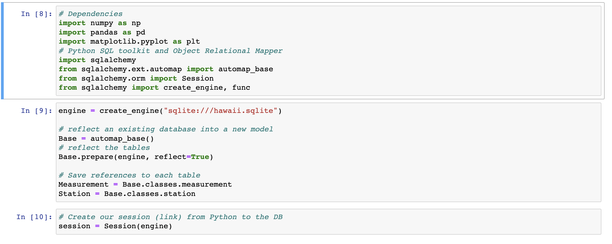
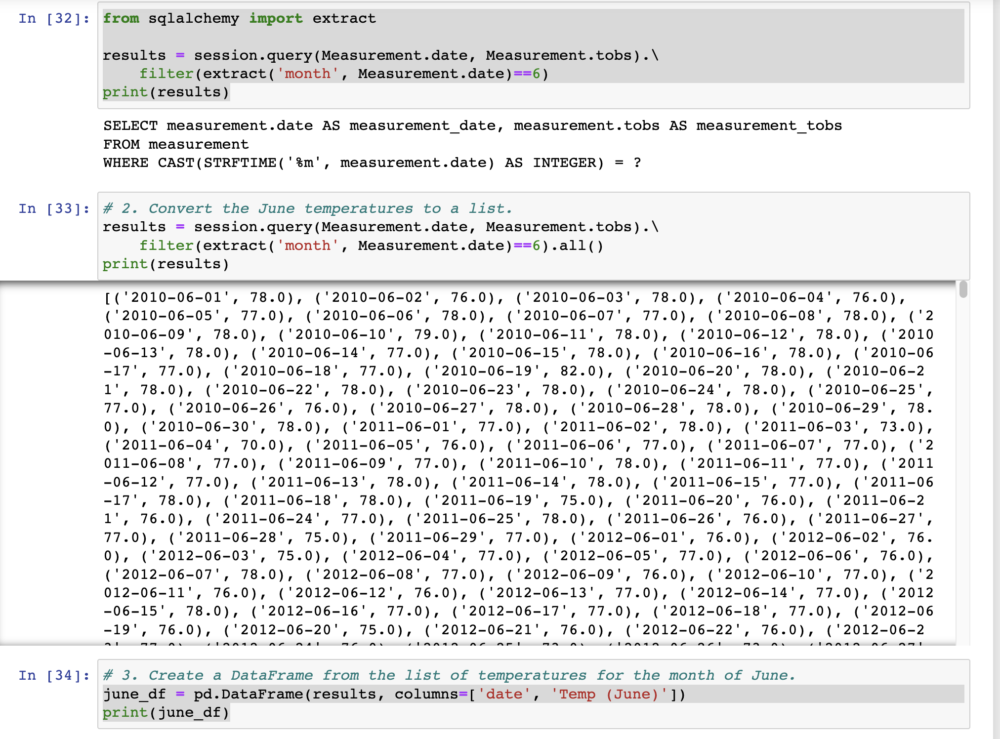
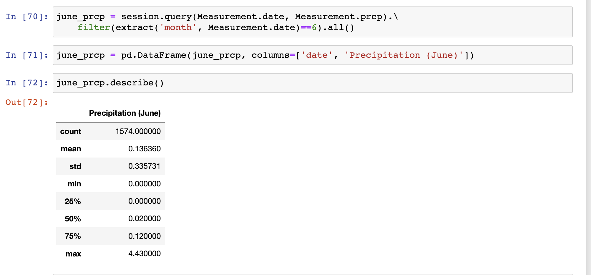
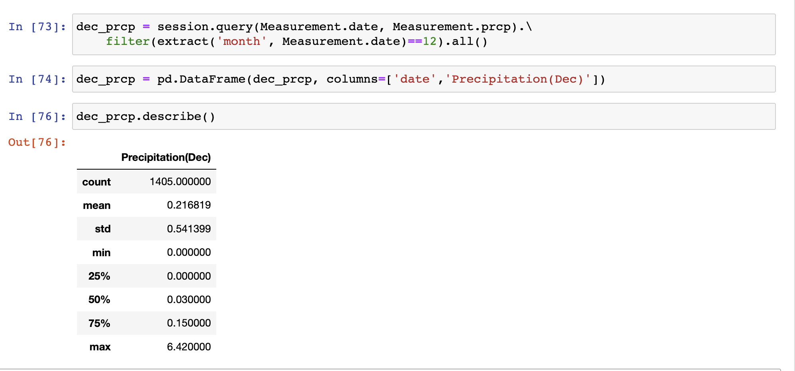

# Surfs Up
#### Purpose of Analysis
The purpose of this analysis was to use SQLalchemy to grab temperatures in June, and grab the summary statistics of the temperatures in June. We also did the same thing to December temperatures.
#### Results

 
##### Three Key Differences
* The count of temperatures(1700 vs 1517)
* The minimum(64 vs 56)
* The first quartile(73 vs 69)

As we see, we have almost 200 more logged temperatures for June, coming in at a count of 1700 whereas December has 1517 logged temperatures. There really isn't a huge difference in the temperature data for these months. The mean comes in really close with Junes being 74 and Decembers being 71. The biggest difference that I see is their logged minimum temp. The coldest it was in June was 64 degrees while the coldest it was in December was 56. There may be different information if December had as many logged temperatures as June did. The first quartile is 73 for June and 69 for December, which hints that it has been colder in December than it had been in June, but not often enough for it to make a huge difference, as the means are very similar.

#### Summary

In order to start off this analysis, we had to make sure SQLalchemy was set up by running the code in the image above.

In the image above is the main formula that gathers all June temperature data, gathering the date, and the temperature, then using extract and filter to only grab the data where the month is 6, which is June. In the second cell we added ".all()" to get the data turned into a list. We then turn it into a pandas DataFrame by putting the results variable as the first argument and naming the columns as the second argument in the DataFrame. That allows us to use ".describe" on the DataFrame to get the summary statistics of the month. This code runs exactly the same for December but instead of month being equal to 6, we set it equal to 12 because December is the 12th month of the year. We run the exact same code to turn it into a DataFrame, except the results variable would be something like results_dec and the columns would just be date and "Temp (December)".

###### Extra Data
Here we gathered some additional data for the amount of precipitation June and December got.
 

These two additional queries suggest that it rains more often in June according to the "count" data, but in general there is more precipitation in December according to the means. Junes mean is .13 while Decembers mean is .21.
