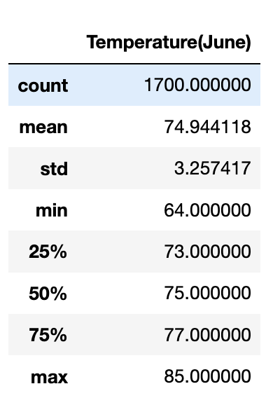

# surfs-up
#### Purpose of Analysis
The purpose of this analysis was to use SQLalchemy to grab temperatures in June, and grab the summary statistics of the temperatures in June. We also did the same thing to December temperatures.
#### Results

 
